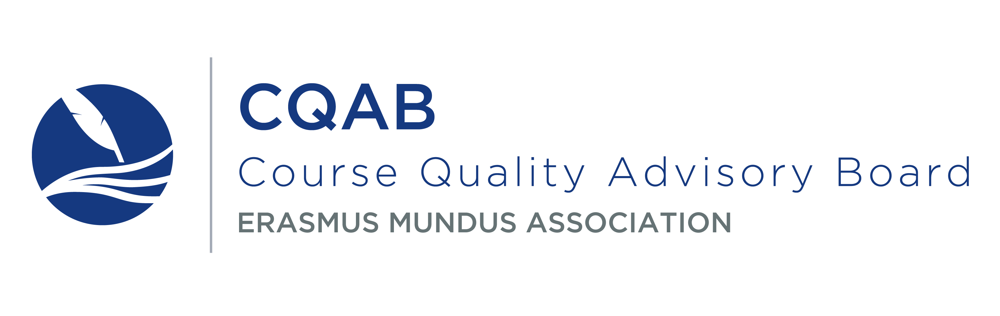

```{r echo = FALSE}
suppressPackageStartupMessages(library(googleVis))
suppressPackageStartupMessages(library(DT))
suppressPackageStartupMessages(library(plotly))
suppressPackageStartupMessages(library(reshape2))
op <- options(gvis.plot.tag='chart')
knitr::opts_chunk$set(echo=FALSE, 
                      warning=FALSE, 
                      message=FALSE, 
                      results = 'asis', 
                      fig.align = "center",
                      dev="png",
                      dev.args=list(type="cairo"),
                      dpi = 96)
```

<script>
$(window).scroll(function(e){ 
  var $el = $('#TOC'); 
  var isPositionFixed = ($el.css('position') == 'fixed');
  if ($(this).scrollTop() > 422 && !isPositionFixed){ 
    $('#TOC').css({'position': 'fixed', 'top': '0px', 'display': 'inline'}); 
  }
  if ($(this).scrollTop() < 422 && isPositionFixed){
    $('#TOC').css({'display': 'none', 'position': 'static'}); 
  } 
});
</script>




#Foreword

The present report was compiled by the Course Quality Advisory Board (CQAB) of the Erasmus Mundus Student and Alumni Association (EMA), with the main purpose of providing an overview of the results of the 2015 edition of the Course Quality Student Services (CQSS) survey. The analysis included in this report offers stakeholders an overview of the quality of services provided by master courses under the Erasmus Mundus umbrella.
 
The CQSS survey is in its second edition. The current edition of the survey introduces a number of improvements. At the suggestion of survey respondents, the 2015 CQSS survey edition was released at the end of the 2014-2015 academic year, to ensure that all respondents have completed at least two Erasmus Mundus Joint Master Degree (EMJMD) semesters before being asked to evaluate their experience. Additional changes have been made to the 2015 edition of the CQSS survey to streamline the survey experience, to facilitate the data analysis process, and to capture information about key subpopulations among EMJMD students. For further reference, a full description of the methodology behind the creation of the 2015 edition of the CQSS survey and the analysis procedures behind the CQSS reports has been published in the academic journal Education Studies Moscow (https://vo.hse.ru/en/2016--1/178804999.html).
 
To date and in addition to the current interactive report, two main products were created using the data collected from the 2015 wave of the CQSS survey. First, CQAB has compiled 78 customized course reports for all EMJMDs who obtained 10 or more responses. These reports were made available exclusively to course coordinators, student representatives of each program, and representatives of the European Commission. At the recommendation of EMJMD consortia, the customized course reports include comparative information about each course in relation to the other EMJMD courses that received a sufficient number of responses.
 
Second, due to our responsibility towards the entire EMJMD community and the over 2,000 students and alumni that fully completed our lengthy survey, the results emerging from the 2015 edition of the CQSS survey were made available to the broad public on an interactive online platform called [Course Browser](https://erasmusmundusassociation.shinyapps.io/Course_browser/). By making this information public, CQAB does not aim at classifying or creating rankings among EMJMD courses, but rather to add transparency to our data analysis, and offer current and prospective students the ability to better prepare for what CQAB considers to be an invaluable educational experience.
 
The work of CQAB would not exist and could not continue without the support of numerous committed volunteers spread across the world, driven by a strong motivation to help improve the quality of EMJMD courses. During the last 18 months, over 40 volunteers were involved with different stages of the CQSS project, from analyzing feedback received following the 2013 edition of the CQSS pilot survey, to coding qualitative data, and interpreting graphical information. CQAB is grateful, humbled and proud to have supported the CQSS project fully through volunteer work, and thus without external interference. Among the CQAB volunteers, one stands out: Mikhail Balyasin. Mikhail is responsible for the substantial improvements to the design and content of course reports, has skilfully generated the graphical information made available in the present report, the customized course reports and created the CQSS interactive online platform.
 
CQAB is grateful for the ongoing support received from the Erasmus Mundus Student and Alumni Association, and its leadership structures. We are indebted to representatives of the European Commission, and EMJMD course coordinators whom we consider allies in a joint quest of consolidating the excellence brand of EMJMDs. CQAB is eager to receive further feedback from each course coordinator and other stakeholders on how future CQSS reports and their contents may be improved in order to maximize their usefulness.
 
Please address all questions and remarks about this report to Georgiana Mihut at cqab.chair@em-a.eu.
 
**Georgiana Mihut**

Chair of the Course Quality Advisory Board

#Course Quality Advisory Board

The Course Quality Advisory Board (CQAB) is an independent advisory body that operates on a voluntary basis as part of the Erasmus Mundus Student and Alumni Association (EMA). Its members have not and do not receive financial incentives for their CQAB-related activities. Internally, CQAB has two main separate structures:

1. EMA Student Advisor function that assists students of Erasmus Mundus courses with pressing quality issues through the email account em.feedback@em-a.eu
2. The Course Quality Student Services (CQSS) initiative, conducted by the CQAB Survey Team
 
CQAB was created to facilitate the quality of the Erasmus Mundus experience for all students, regardless of their course. To accomplish this, CQAB has designed a variety of tools to capture student concerns and to facilitate meaningful dialogue between student representatives from various programs. Our most comprehensive and systematic initiative focused on quality assurance is the CQSS survey. For more information about CQAB, please visit our [website](http://www.em-a.eu/en/about-ema/course-quality-advisory-board.html).

#Overview of Survey and Report

The Course Quality Student Services (CQSS) survey was created to learn about the experience of Erasmus Mundus Joint Master Degree (EMJMD) students. From the onset, the survey was designed to capture comparable information in order to offer EMJMD programs reliable information about itself and other peer programs.

The philosophy of CQAB is to share as much information as possible about the CQSS survey results with relevant stakeholders. We strongly believe that all relevant decisions and results interpretation must be made per course.
 
The current report is another way for us to share more information with stakeholders. The focus of this report is to provide an overall picture on how various services were rated by respondents to the 2015 wave of the CQSS survey across all EMJMD courses. For this reason each theme or section of the report is presented in three complementary ways:

1. Interactive graphs which plot means for courses with 10 or more responses on that particular question. See below an explanation on how these means are calculated.
2. Graphs illustrating the distribution of responses with respect to the year when respondents began their studies. Responses are distributed in 4 categories: students that began their studies in 2014, 2013, 2012, and all earlier years (labelled “Alumni”).
3. Excerpts of relevant qualitative quotes that were prepared specifically for this report by CQAB’ qualitative team.
 
CQSS survey respondents were asked to rate each indicator on a 4-point Likert-scale with following options:

1. “Very unsatisfied”.
2. “Somewhat unsatisfied”.
3. “Somewhat satisfied”.
4. “Very satisfied”.
 
Students’ answers were then translated into numerical forms with 1 being “Very unsatisfied” and 4 - “Very satisfied”. Numerical values were then used to calculate means for each question for each course with 10 or more responses on any given question.

#Overview of EMJMD Programs

This section offers some descriptive information on the identity of the respondents to the 2015 edition to the CQSS survey. Information about the self-declared nationality, gender, age, disability status, year when students began their studies and scholarship status is included. The number of respondents for each program is given in the table below.

```{r programs, results = "asis", echo = FALSE}
DT::datatable(tenormore, rownames = FALSE)

```

The distribution of respondents’ nationality is shown in the map below. Dark blue indicates that a higher number of respondents state they originate from the respective country. In 2015, the highest number of respondents from a single country was 147 (India).

```{r nationalities, results='asis', tidy=FALSE, echo = FALSE}
overalldf <- overall %>%
  select(A.7.What.is.nationality.please.choose.one.only._Response) %>%
  group_by(A.7.What.is.nationality.please.choose.one.only._Response) %>%
  summarise(respondents = n())
names(overalldf) <- c("Country", "respondents")
overalldf <- overalldf[complete.cases(overalldf$Country),]

Geo <- gvisGeoChart(overalldf, colorvar = "respondents", locationvar = "Country", 
                    options = list(colors = "['#F6F3EC','#004E86']"))
plot(Geo)
```

Of the 2,131 survey respondents, 977 self-declared as female respondents, 1,135 self-identified as male, and 19 either declined to respond or indicated “other” as their gender.


```{r gender, results = "asis", tidy=FALSE, echo = FALSE, warning=FALSE}
gender <- as.character(overall$A.9.Gender._Response)
gender[is.na(gender)] <- "No response"
gender <- as.data.frame(summary(as.factor(gender)))
names(gender) <- c("Number")
DT::datatable(gender,options = list(dom = 't', searching = FALSE,
                                                    columnDefs = list(list(width = "190px", targets = "_all")),
                                                    align = "center"
                                                    ))

```

The age of respondents is distributed between 20 to 60 years old, with a mean value of 25 years old (263 respondents). The majority of respondents are between 20 and 40 years old. A small percentage of respondents are between 40-60 years old.

The CQSS survey also aims to gather information about the experience of EMJMD students with disabilities. Thirty-four (34) survey respondents indicated they had a diagnosed disability.

```{r age, echo = FALSE}
Age <- as.data.frame(overall$A.8.Age._Response)
names(Age) <- "Age"
p <- ggplot(Age, aes(x = Age)) + geom_histogram(fill = background_color, colour = "black", binwidth = 1) + 
           xlab("Age") + ylab("count") + 
           theme(panel.background = element_rect(fill = background_text))
ggplotly(p)

```

In 2015, the CQSS survey collected data from all students and alumni of EMJMD programs, regardless of the year when they started their course. Students who started their EMJMD course in 2014 have the highest representation among respondents (666 respondents). These students had just finished the first year of their study before completing the CQSS survey. Altogether, 1,330 respondents were either first year or second year students at the time they completed the survey. As such, 62% of CQSS respondents were active students, and 38% were alumni.

```{r disability, results = "asis", echo = FALSE}
disability <- as.data.frame(summary(overall$A.12.Do.you.have.any.diagnosed.disability._Response))
names(disability) <- c("Number")
DT::datatable(disability,options = list(dom = 't', searching = FALSE,
                                                    columnDefs = list(list(width = "190px", targets = "_all")),
                                                    align = "center",
                                       order = list(list(1, 'desc'))
                                                    ))

```

In 2015, the CQSS survey collected data from all students and alumni of EMJMD programs, regardless of the year when they started their course. Students who started their EMJMD course in 2014 have the highest representation among respondents (666 respondents). These students just finished the first year of their study before completing the CQSS survey. Altogether, 1330 respondents were either first year or second year students at the time they completed the survey. As such, 62% of CQSS respondents were active students, and 38% were alumni. 

```{r year, results = "asis", echo = FALSE}
year <- as.data.frame(summary(as.factor(overall$A.5.When.did.you.start.EM.Course._Response)))
names(year) <- c("Number")
DT::datatable(year,options = list(searching = FALSE,
                                  columnDefs = list(list(width = "190px", targets = "_all")),
                                  align = "center",
                                  order = list(list(1, 'desc')),
                                  pageLength = 11
                                  ))

```

For students and alumni, the hallmark of EMJMDs is the generous scholarship many are eligible to receive. However, the number of self-paying students is increasing among courses. Among the CQSS respondents, 1,674 were granted an Erasmus Mundus scholarship and 457 were self-funded students.

```{r scholarship, results = "asis", echo = FALSE}
scholarship <- as.data.frame(summary(as.factor(overall$A.10.Have.you.been.awarded.an.Erasmus.Mundus.scholarship.for.master.studies._Response)))
names(scholarship) <- c("Number")
DT::datatable(scholarship, options = list(dom = 't', searching = FALSE,
                                                    columnDefs = list(list(width = "190px", targets = "_all")),
                                                    align = "center"
                                                    ))

```


#Supporting services

The main scope of the CQSS survey is to offer insights into the quality of support structures offered to and received by EMJMD students. A significant section of the present report is devoted to this topic. CQSS respondents were asked to express their degree of satisfaction with the quality of support services received before the start of the program, during their orientation, the general level of helpfulness of various support structures, and the quality of support received on specific issues.

##Support received before the start of the programs

CQSS survey respondents were asked to rate their satisfaction with the information and support received before the start of their EMJMD. This section summarizes their responses. Median values for all indicators in this section lie above 3.0 on a scale from 1 to 4. This overall mean indicates that EMJMD students are overall “Somewhat satisfied” with the support received prior to starting their program, with respondents of 50% of programs expressing relatively high levels of satisfaction.
 
Within the dimension, the spread of the distribution of course means varies across indicators. For indicators “Standards of behaviour”, “Enrolling in classes” and “Course content” almost every mean lies above 3.0, value equivalent with “Somewhat satisfied”. At the same time, there are relatively widespread differences in ratings on the following indicators: “Information about fieldwork”, “Timetable” and “Evaluation methods”, indicating that there is still room for improvement across courses and that best practices may be shared among programs.
 
Open statements made by respondents provide some insights into the ratings offered as part of this dimension. A number of students expressed their concerns with a lack of information delivered before the start of their studies, particularly about enrolment and course content. One such respondent explained, “I would have liked to have had a lot more specific information about the course before arrival. The logistical side of things was good (housing, etc.) but I felt very uninformed about the course itself prior to the beginning of the orientation”. Several others stressed their desire to be better informed, couched in phrases  such as; “more clear guidelines on when to register for courses and housing, especially when switching universities”, “more information/advice about practical issues (i.e. semester plan, schedule)”, and “proper information before starting the course and also improving the course website” are needed.

```{r supp_before, fig.width=8.5}
z <- gsub("2004|2005|2006|2007|2008|2009|2010|2011", "Alumni", overall$A.5.When.did.you.start.EM.Course._Response)
levels <- c("Alumni", "2012", "2013", "2014") 
z <- factor(z, levels = levels)
means_printing_plotly("B.1.1")

```

The graph below shows the distribution of answers to the same question by year of enrolment (or the year when students began their EMJMD studies). On almost all indicators, current students tend to rate their experience less favourably than alumni. The only indicator where this is not the case is “Standards of behaviour”, where every student cohort seems to be overall content with the information and support received.
 
The aforementioned trend is especially pronounced on three indicators: “Evaluation methods” where 15% more students enrolled in 2014 than alumni provided negative feedback, “Timetable” where 16% more students evaluated the course negatively, and “Course content”, where the difference is 11%. For the dimension “Enrolling in classes” this difference is rather small, with only 6%. At the same time the indicator “Information about fieldwork” received overall low ratings across cohorts. This is also the only indicator where the share of “Very unsatisfied” responses is remarkably stable over the years.
 
```{r supp_before_group, fig.height=8}
questionprint_grouping("B.1.1", overall, grouping = z, grouping_levels = levels)

```

##Support received during orientation program

Students and alumni were asked to indicate how satisfied they were with the introduction process to various units and individuals as part of the orientation program. Responses across indicators in this section suggest a relatively high satisfaction level among EMJMD students and alumni, with median values above 3.0. Due to the spread of the distribution of means across programs, action for improvement and best practices sharing among programs could occur for the indicators “Buddy or tutor system”, “Student associations” and “International student office”. Mild and extreme outliers across all indicators placed between “Very unsatisfied” and “Somewhat unsatisfied” indicate that few courses are in particular need of improvement.
 
Student associations and buddy/tutor systems are considered by students as particularly important means of integration and the poor quality of these support structures has been identified as a challenge in open answers given by survey respondents many times. To exemplify, one respondent stated “it's my first time being in Europe, daily life can be complicated in the first months and having this person to clarify simple things that we might not sure of (we can google now, but still) and/ or to gives assurance/ support would be extremely beneficial”, while other respondents stressed how buddy programs could “help to learn languages, culture and more about the country” and “make settling into the new place(s) during the first few weeks a whole lot easier”. Suggestions from respondents on how to improve their course integration process include “better information to and participation of EM students in student associations at respective universities.  Tutors must be assigned and their performance checked at consortium universities”, and “2nd year students could be assigned as buddy to first year students”. Furthermore, respondents expect international offices to be “more proactive”, “more helpful, supportive”, “involved”, “present”, and “prompt” with their e-mail communication. Some students expressed their dissatisfaction with the international office services by stating that “the responsible staff often did not reply to emails to answer questions and the door of the international office was locked most of the time”, “international student office was not very friendly”, and “international office is not regularly responding to emails.”

```{r orientation, fig.width=8.5}
means_printing_plotly("B.1.3")
```

The graph below shows the distribution of answers by year of study. There are no noticeable trends across indicators; however, the least favourable responses were registered for “Buddy or tutor system” and “Student associations”. These indicators received negative feedback from more than 20% of respondents in all cohorts. Most other indicators received less than 20% negative responses across cohorts except “International student office” which received 21% negative responses from students who enrolled in 2014.

```{r orientation_group, fig.height=10}
questionprint_grouping("B.1.3", overall, grouping = z, grouping_levels = levels)
```

We advance four speculative factors contributing to the higher negative responses on “Buddy or tutor system” and “Student associations”. First, most EMJMDs require students to stay for 4-6 months in each university during the program. As such, students have less time to merge with local students and robust support structures are needed as catalysts. Second, most students of EMMJDs come from different countries and cultures which pose additional integration difficulties. Thirdly, the high mobility of EMJMD students makes the availability of peers, colleagues, buddies or tutors among students enrolled in the prior years of program limited, thus making inter-cohort exchanges difficult. Finally, different curricula and separate courses between EMJMD and local programs further complicate the integration process. This complex reality faced by EMJMD students indicates a stronger need for support structures that facilitate integration.

##Helpfulness of units and people

This section shows the respondents’ assessment of the helpfulness of different units and people involved in their master courses. Similar to the previous two sections, the responses show relatively high satisfaction - median values for all the dimensions are above 3.0, which is equivalent to the “Somewhat satisfied” option in the survey.
 
However, the responses are not fully coordinated, which is, again, similar to the two previous sections. In this section, “Buddy or tutor system” and “Student associations” are notable in the sense that they are the only indicators for which not all means fall above “Somewhat satisfied”, meaning that there were significant percentages of respondents who were unsatisfied with these units. The median values for these two indicators are also noticeably lower than for the other six indicators, which suggest that the organizing institutions should pay additional attention to the improvement of these components as part of their courses.


```{r helpfulness, fig.width=8.5}
means_printing_plotly("B.2.1")
```

When the responses are distributed according to the respondents’ year of enrolment, in the second graph, no special trends are identified. The only exceptions are two indicators - “Academic staff” and “Administrative staff”, where a trend similar to the previous two sections is noticeable. In these two dimensions, the least satisfied students are the ones in the first year of their master course, while the alumni are least unsatisfied. However, the differences between the different cohorts are not great - for both dimensions, there are 5% more of unsatisfied first year students than alumni.

```{r helpfulness_group, fig.height=10}
questionprint_grouping("B.2.1", overall, grouping = z, grouping_levels = levels)
```

While the smaller dissatisfaction rates among the alumni could be explained by the passage of time, which perhaps allowed them to put the helpfulness of “Academic staff” and “Administrative staff” into a new, more understanding perspective, it seems that the lack of helpfulness from “Buddy or tutor system” and “Student associations” left a more lasting impression on the respondents. It is interesting to note that the percentages of respondents unsatisfied with the helpfulness of “Other students” are quite lower than the percentages of those unsatisfied with the two previously mentioned dimensions, which could mean that they had less access to the more formalized structures of student organizing, had less information about them, or simply found that these structures did not fit or represent their needs adequately. The results of our survey, however, allow us only to speculate on the reasons for these differences.


##Support received on various issues

In this section, the respondents were asked to rate the support received  on the indicators “Financial issues”, “Health insurance”, and “Inappropriate conduct or sexual harassment issues”. Even though the median values for all three indicators fall above 3.2, which is here equivalent to “Somewhat satisfied”, the distribution of means is varied. For “Inappropriate conduct or sexual harassment issues”, the median value is actually 3.6, and all the means cover a fairly small range, all falling within the 3th and 4th quartile. The means of the other two dimensions cover a much broader range, which means that the respondents’ satisfaction with these forms of support is much more varied and there are larger percentages of those who are unsatisfied.
 
Open responses pertaining to the indicator “health insurance” generally signal a lack of information on how to use the provided insurance in different countries. One respondent stated “it would be useful to inform students that using the centralized health insurance automatically offered to scholarship holders in Germany might create problems for those intending to stay in the country upon graduation, i.e. in my case inability to get the regular national health insurance until finding employment (unless of course your employment starts right after the EM course completion)”, while another one suggested “absolutely no information about the health system, the French one is quite complex and as a French student I was not concerned by this type of information, but I was completely lost while trying to help my friends on that subject.” Open answers suggest that financial challenges mentioned by the students may be due to the high accommodation expenses in certain mobility locations, the cost of administrative procedures, and transportation costs.

```{r support_on, fig.width=8.5, fig.height=3}
means_printing_plotly("B.2.2")
```

In the distribution of the responses according to the respondents’ year of enrolment, only “Financial issues” show a trend. It is the same trend already identified in some of the previous sections, namely that the percentage of unsatisfied students falls with time. In this case, the 2012 cohort and the alumni show the same rate of satisfaction, smaller than among the 1st-year and 2nd-year students, which could be interpreted as due to the smaller relevance of “Financial issues” once the master course is completed.

```{r support_on_group}
questionprint_grouping("B.2.2", overall, grouping = z, grouping_levels = levels)

```

Although the means for the “Inappropriate conduct or sexual harassment issues” dimension would indicate high satisfaction rates, the second graph shows that three out of four cohorts - 2014, 2012, and alumni - have significant percentages of respondents (11%) who are unsatisfied with the support received. For an issue like this one, these are high percentages, which should be taken into serious consideration and addressed by the participating institutions.

#Assessment and Feedback

##Module assessment
In this section students were asked to evaluate aspects regarding the availability of course coordinators to discuss and follow up with unresolved issues, course feedback mechanisms, aspects connected to the evaluation of academic work and the provision of transcripts and degrees.

```{r module_asses, fig.height=8, fig.width=8.5}
means_printing_plotly("C.1")
```

Respondents to the CQSS survey were asked to rate the following two indicators regarding the availability of course coordinators: “The willingness and ability of the course coordinators to follow up on unresolved issues addressed” and “Availability of course coordinator to discuss questions or problems related to my study and mobility experience. Respondents across courses were generally satisfied with the availability and support of course coordinators. The mean across courses for these indicators were above 3.3, thus suggesting that students are overall “somewhat satisfied" with the involvement and availability of course coordinators. The spread of the distribution of means suggests that while students of most courses are content with the support received from their supervisor, a few exceptions exist. The lowest course mean on the indicator “The willingness and ability of the course coordinators to follow up on unresolved issues addressed” is 1.8, which suggests that students of this course are very unsatisfied with the support received from course coordinator.
 
Such concerns are among the open responses received. One respondent stated “the director of the department was very absent and non-responsive”, another one discussed “we wrote emails to the coordinator but replies were late or non-existent”, and another respondent wrote “the director of the course avoids us when he knows that we are not glad with the course”. In trying to interpret such types of circumstances, one respondent mentioned, “It comes down to who's in charge and how approachable/available they make themselves.” A respondent wrote that “Administrative staff is very often defensive and not responsive to the issues faced by the students. Instead of using the excuse of ‘this is the French way’ or ‘this is France’, the staff should consider to using ‘let's work this out together’”. These respondents stressed that more needs to be done in reaching out to students. They stressed that academics and administrative staff need to engage students in consortium-wide discussions, and be more flexible to accommodate their suggestions.
 
Students are overall satisfied with the “Information provided about the type of degree to be awarded” (mean across courses = 3.16) and somewhat less satisfied with the information provided about the provision of certificates and transcripts (mean across courses = 3.07).
 
A number of open comments from respondents reveal that problems persist in issuing degree certificates and academic transcripts. One respondent stated, “I did finish my masters on February 2010. It is now June 2015. Still I did not get my official master's degree”, while another respondent wrote, “after I have graduated for 3 years, I have not received my graduation certificate from my second University... and most of my classmates haven’t got their Spanish and Portuguese certificates.”
 
Indicators measuring the satisfaction of students with feedback mechanisms available at the level of the course received mixed scores. The indicator “Implementation of recommendations given by students to improve EM course experience” received a mean score of 2.86 and “Formalized system by university consortium for students to share opinions and feedback on course” received a score of 2.97. Significantly, one course obtained the very low mean 1.58 on the indicator “Implementation of recommendations given by students to improve EM course experience”.
 
Among open comments, a considerable number of respondents expressed their wish to have consortiums install formal channels through which students can easily give feedback and suggestions on academic, administrative and a range of other issues. This was reiterated in statements such as “although the course convenor was always available and did a great job in answering our questions I felt like it was not an "official" channel of feedback/questioning”, and “a more formalized system for students to give feedback for each course is needed”. When explaining how this can be achieved, one respondent recommended that “every lecturer provide a formal system for students to anonymously write their opinions not just an informal voice channel. I propose that this formal system be active throughout the semester and not just afterward when the improvements will not be seen by the critiquing students. In this way the student may affect positive change on the module that they are attending. The same system as above can be used for students to give general feedback on their experience other than course modules.” Respondents also highlighted the significance of building a formal system for evaluating not only specific courses, but also administrative staff and services, as well as for programs in their entirety.
 
Similarly, indicators measuring the satisfaction of students with the evaluation of their academic work across universities suggest that there is room for improvement across most courses in integrating the evaluation systems across consortium universities and providing further feedback to students. The indicator “Feedback on evaluation of results and grades” obtained a mean score of 2.83, equal to the mean score of the indicator “Grade conversion across universities”. The related indicators “Clarity of evaluation criteria across universities” and “Consistency of module assessment across universities” obtained equal means of 2.79. The highest means obtained on these four indicators were also overall lower than the highest scores on most indicators in the survey.
 
Open comments offered accounts that suggest that in few instances the clarity of evaluation could be improved. Some respondents stated, “...It is a mystery how the professors determined our marks. They should use more evaluation tools, not only a single, dense and final exam”, “we were not given any guidelines or example essays/exams to look at, for us to understand what is asked of us”, “many lecturers were unwilling to discuss their grading system”, and “our works should be graded based on a common key of correct answers and not e.g. on the length of the answer.” Still some respondents reported instances where they underwent uncommon evaluation practices such as oral exams given inside the offices of professors. In addition to challenges related to clarity and transparency of evaluation, the results of the survey also indicated that a significant number of respondents complained about poor consistency and coordination between consortium universities when it comes to evaluating student work and recording grades. For instance, some respondents reported, “...evaluation systems were a bit unfair in some universities when compared to others”, “while feedback was sought on earlier modules, it was however never sought for the fourth university”, and “French academic culture does not encourage feedback from teachers, and I believe this was apparent in (name of university) where we received quality feedback from certain professors (...), but not from the others (or very partially)”.

```{r module_asses_group, fig.height=12}
questionprint_grouping("C.1", overall, grouping = z, grouping_levels = levels)
```

The indicators listed in the dimension “Module assessment” seem to gather a higher overall number of negative evaluations from students. This is particularly applicable to the indicators measuring the academic evaluation received by students. While alumni seem to evaluate the dimension “Module assessment” more favorably, they too offer mixed ratings to courses on indicators such as “Clarity of evaluation criteria across universities”, “Consistency of module assessment across universities”, and “Feedback on evaluation results and grades”.

#Teaching/Learning and Supervision

##First supervisor

This dimension aimed to gather student opinions on the quality of the interaction and support received from academic supervisors during the process of conducting their master thesis research and writing their master thesis. Information about both first and second supervisors was collected from second year students and alumni only. Each of them is evaluated across two indicators “My supervisor was available for period meetings” and “My supervisor provided valuable advice during my thesis work”.

```{r first_sup, fig.height=3, fig.width=8.5}
means_printing_plotly("L.4")
```

Students across EMJMDs seem overall satisfied with the support received from their first supervisor, with mean values of 3.6 and above for both evaluated indicators. In addition, the highest mean received for a course on the dimension “Teaching/learning and supervision” was the maximum obtainable mean 4.0. The lower end of the mean distribution suggests that supervision problems may be encountered across few courses.

```{r first_sup_group, fig.height=3.5}
#questionprint_grouping("L.4", overall, grouping = z, grouping_levels = c("Alumni", "2012", "2013"))
```

The indicator “My supervisor provided valuable advice during my thesis work” has gathered a slightly higher rate of negative responses from alumni than enrolled students, in contrast to most trends noticed throughout the data.


##Second supervisor

In addition to the indicators included in the evaluation of the first supervisor, the evaluation of the second supervisor includes an additional indicator “My second supervisor was available for consultation if the lead supervisor was unavailable”. Similarly to the evaluation of the support received from first supervisors, students were overall content with the support received from second supervisors. However, the means across courses for indicators pertaining to second supervisors were slightly lower than for the equivalent indicators pertaining to first supervisors, but still above 3.48. The lower bound of the mean distribution also reached a smaller mean value (2.36) for second supervisor than first supervisors (2.64).

```{r second_sup, fig.height=4, fig.width=8.5}
means_printing_plotly("L.5")
```

Across indicators and across cohorts there is a slightly higher level of dissatisfaction with the contributions of second supervisors. Again, this slightly increased level of dissatisfaction is higher for alumni than current students.
```{r second_sup_group, fig.height=4}
#questionprint_grouping("L.5", overall, grouping = z, grouping_levels = c("Alumni", "2012", "2013"))
```

#Internship Experience and Personal Development

##Internship experience

EMJMD students and alumni are overall satisfied with the quality of their internships. The indicators in this section evaluated aspects such the relevance of the internship to the current career of respondents, the overall quality of the internship, the logistic support received during the internship experience, how valuable the internship was from the respondents’ perspective, the quality of supervision during the internship, its duration and timing, and lastly, the relevance of the internship to the field of study. All indicators measured in this dimension obtained mean values across courses of 3.17 or above. Few outliers exist, as one course obtained a mean value of 2.3 on the indicator “Overall quality of the internship”.
 
Open responses suggest that there is an overall high level of satisfaction with the quality of internships, but that dissatisfaction exists among students whose programs do not offer an integrated internship component. A number of respondents stressed the importance of the internship experience in gaining employment after graduation. One stated "No experience, no job. The internship is absolutely necessary in order to get experience. I had a thesis but not a real internship”, while two others reported “I could have been provided with more internship opportunities (when I came to (name of university) internship was optional and the choice was limited to two organizations)”, and “I also think that I missed practical education, for example using various measurement instruments for land surveying, internship, or involving students in work on the ongoing research projects.” In addition, those who had internship experience wished for longer internship periods “to have a clear picture of labour market in this field as early as possible”, having internships in companies “where foreigners are eligible for employment”, and receiving “better support for finding an internship”.


```{r internship, fig.width=8.5}
means_printing_plotly("L.2.a")
```

```{r internship_group, fig.height=10}
#questionprint_grouping("L.2.a", overall, grouping = z, grouping_levels = c("Alumni", "2012", "2013"))
```

As noted before, students and alumni reported an overall high level of satisfaction with their internship experience. Students and alumni evaluated internship related indicators similarly. Notably, all alumni evaluated positively the value of their internship for their future career.


##Personal development

Indicators in section 8.2, offer insight into the opinions provided by second year students and alumni of EMJMD programs about their personal development, the relevance of support received to their transition to the labor market and future educational programs and their overall level of satisfaction with their EMJMD experience.

```{r development, fig.height=8, fig.width=8.5}
means_printing_plotly("L.6")
```

Students and alumni of EMJMDs are overall highly satisfied with their personal development during their course and their ability to pursue desired career opportunities. The indicators “I am satisfied with my current position”, “I believe my course helped me achieve my current position if employed or student”, “I feel my Erasmus Mundus course prepared me for my career”, " The course has enabled academic and personal achievement beyond my initial expectations”, “My soft skills were improved by my course”, “I feel optimistic about my opportunities for employment“, and “I feel my Erasmus Mundus course has prepared me for my future chosen career" obtained mean values across courses between 3.29 and 3.69.
 
Open comments indicate that a considerable number of respondents referred to their participation in the master’s programs as a “life-changing experience”. Most believed that their enrolment in an EMJMD has helped them progress towards a successful career. The overwhelming majority of respondents who provided open comments reiterated that they benefited academically, personally, socially, and professionally. A respondent summarised these points in a statement, “It has boosted my career, my future, my mentality, and my general knowledge and wisdom…I got to know international students, visited different countries, got cultural experience, met international researchers…it also gave me the opportunity to expand my social and academic networks…” Moreover, respondents seemed to agree that the courses were relevant to their career goals, and that it helped them become professionals in their fields.
 
The indicators that received overall lower ratings are “My transcript and certificates were provided in a timely manner” with a mean value 3.36, but a wider spread of means, with the lowest mean value for a course of 2.36, and “I was well advised by my course on future education opportunities”, with a mean value of 2.8.
 
As much as feeling satisfied with their personal and professional development experiences, the students also openly stated that their experiences could be further improved to maximize better employment opportunities. “Promoting communication between students and private or public companies”, “hosting a career day, “hosting a special (study field related) vacancy website”, “campus recruitment”, “more emphasis on skillsets in demand in industries”, “career events”, and creating “a better network, for example, by proposing mini conference with researchers involved in the program” are a few of the suggestions made by the respondents on how they think their EMJMD course could have supported them better for their future careers. Concerning future academic or career advice the students receive during their studies, respondents mentioned they expect more guidance from their course professors. “More encouragement for those willing to pursue an academic career”, “having a possibility to discuss with a mentor (teacher) that could point out which educational paths bring different work possibilities”, and “more mentoring and advising” are a few points of improvement expressed by the students on this specific dimension.


```{r development_group, fig.height=10}
questionprint_grouping("L.6", overall, grouping = z, grouping_levels = c("Alumni", "2012", "2013"))
```

The trends presented above are visible in the distribution of responses among EMJMD students and alumni. Alumni seem slightly more satisfied with their personal development. Noteworthy, most recent graduates from EMJMDs show a slightly higher degree of concern regarding their opportunities for employment and are significantly less satisfied about the advice received from their courses on future educational opportunities, with 50% of 2012 respondents feeling either very unsatisfied or somewhat unsatisfied with the advice received on future education options.


#Questions about EMA

The CQSS survey asked respondents to answer two questions on their knowledge about the Erasmus Mundus Student and Alumni Association (EMA). The first questions aims at understanding how familiar EMJMD students and alumni are with the existence of EMA and the second question asks respondents if they are aware of the fact that each course can elect an EMA program representative (PR). Program representatives connect EMJMD courses to EMA and have the responsibility to advocate on behalf of students and alumni. Most survey respondents are aware of both the existence of EMA and the possibility to elect a PR. The high number of respondents that are aware of the existence of EMA may be explained by the fact that EMA related channels were used to disseminate the CQSS survey. This selection bias might indicate an inflated level of awareness about EMA among EMJMD students and alumni. The higher incidence of respondents (579) unaware of the possibility to elect a PR suggests that EMA should better advertise this function among EMJMD students and alumni.

##Are you aware of existence of EMA?
```{r existence}
existence <- as.character(dataset$J.1.Please.answer._Are.you.aware.of.the.existence.of.the.Erasmus.Mundus.Students.and.Alumni.Association.)
existence[is.na(existence)] <- "N/A"
existence <- as.data.frame(summary(as.factor(existence)))
names(existence) <- "Number"
DT::datatable(existence, options = list(dom = 't', searching = FALSE,
                                                    columnDefs = list(list(width = "190px", targets = "_all")),
                                                    align = "center",
                                       order = list(list(1, 'desc'))
                                                    ))
```

##Are you aware that each program can elect EMA Program Representative
```{r election}
election <- as.character(dataset$X.153_Are.you.aware.that.each.programme.can.elect.an.EMA.Programme.Representative.)
election[is.na(election)] <- "N/A"
election <- as.data.frame(summary(as.factor(election)))
names(election) <- "Number"
DT::datatable(election, options = list(dom = 't', searching = FALSE,
                                       columnDefs = list(list(width = "190px", targets = "_all")),
                                       align = "center",
                                       order = list(list(1, 'desc'))
                                      ))

```


#Key takeaways

This report has provided an overview of the results obtained in the 2015 edition of the CQSS for the 78 EMJMD courses for which CQAB gathered 10 or more respondents. It is important to note, once more, that any consideration of the results of this survey needs to take into account the spread of distribution of results. This is particularly the case with those dimensions where some of the courses fall well below or above the mean. These outliers point to a great diversity in certain aspects of the courses, which requires us to exercise caution when interpreting the survey’s results. Aside from providing a broad overview about the quality of services among EMJMD course, this report allows us to identify certain trends with important implications for program coordinators and participating institutions, but also for the Erasmus Mundus program as a whole. These trends are discussed below.

<h3>Differences in average satisfaction rates between current and former students</h3>

Data collected on several dimensions show that respondents’ satisfaction with various services and aspects of their EM experience increases over time. Alumni are generally more likely to evaluate a course positively. Alumni and second-year students’ higher satisfaction with the support provided regarding dimensions such as “Financial issues”, “Evaluation methods”, “Timetable”, or “Course content” indicate that the practices of providing information, especially for first-year students, can be improved.

<h3>Low satisfaction with tutor/buddy systems and student associations</h3>

The specific characteristics of being an Erasmus Mundus student, such as typically short stays at a university, mobility and diverse cultural backgrounds, can provide some explanation as to why the CQSS respondents have reported low satisfaction with the helpfulness and support received from tutor/buddy systems and student associations at the partner institutions. Even so, the more positive assessment of the helpfulness of other students indicates that the difficulties in communication lie in the structure or functioning of the students’ formal organizing and not in the students themselves. These results offer a chance to advocate for a solution which would be better tailored to the needs and circumstances of Erasmus Mundus students.

<h3>Low satisfaction with grade conversion and evaluation across universities</h3>

Establishing consistent evaluation criteria and practices across universities from different educational systems is arguably one of the most challenging aspects of the EMJMD courses, but the results of this survey show that there is still much need for improvement on this matter. In particular, students seem to want more information and feedback on evaluation, with greater clarity and consistency.

<h3>Timely provision of diploma and transcripts</h3>

Survey respondents often indicated that diplomas and transcripts should be provided in a timely and systematic manner. While this remains a challenging task when universities in different countries need to cooperate, it is important for study certificates to be offered to students as needed. The start of a PhD and gaining employment may be jeopardized by heavy bureaucratic procedures associated with issuing academic certificates.

<h3>High overall satisfaction across multiple indicators and dimensions</h3>

Erasmus Mundus Joint Master Degrees pave the way for greater integration and cooperation among universities within Europe and beyond. This task is challenging but has proven to be overall very successful. Most indicators evaluated by the CQSS survey show that students are overall satisfied with their experience and the quality of the services they received.

The Course Quality Advisory Board sees the CQSS survey as a tool to provide peer support among the Erasmus Mundus students and alumni. By preparing and conducting the survey, responding to it, and taking part in advocacy activities based on its results, former and current EMJMD student are taking responsibility for helping each other and using their Erasmus Mundus experience to benefit everyone involved in this program.

#About the authors
<h3>Mikhail Balyasin</h3>

Mikhail Balyasin has finished the Erasmus Mundus program Masters of Science in Research and Innovation in Higher Education (MaRIHE). In CQAB he is currently the head of the quantitative team and responsible for data visualization and the overall representation of CQSS data to a broader public. Connect with Mikhail via [LinkedIn](https://de.linkedin.com/in/mikhailbalyasin), [GitHub](https://github.com/romatik/) or [Facebook](https://www.facebook.com/mikhail.balyasin). 

<h3>Georgiana Mihut</h3>

Georgiana Mihut is a Research Assistant at the Center for International Higher Education and a doctoral student at the Boston College Higher Education program. Her research interests concern the impact of university reputation on the employability of graduates, quality assurance in higher education, and international higher education. Georgiana is the chair of CQAB since February 2015.

<h3>Tijana Maksimovic</h3>

PhD fellow In Educational Sciences at Aarhus University, Denmark, where she also graduated from the EMJMD European Master in Lifelong Learning: Policy and Management. She specializes in career guidance and counselling, with a particular interest in school-to-work transitions, career identity, and international mobility. In her PhD project, she is exploring the career development of international PhD students in technical and natural sciences in Denmark and how they experience the transition to a post-PhD career. 

<h3>Daniel Prasetyo</h3>

Daniel Prasetyo is a master graduate of Erasmus Mundus Joint Masters Program. After finished his bachelor degree in Indonesia, he continued his study in Erasmus ME3 program which gave him a chance to study in Universidad Politecnica de Madrid, Spain, Queen’s University Belfast, UK, and Ecole des Mines de Nantes, France. As a chemical engineer, he has been working in several multinational company such as BASF Corporation USA and GE Energy France. Besides his interest in scientific and engineering area, he also has an interest in organization and social activities. Last year he was the ME3 Programme Representative and this year he is joining the CQAB team as quantitative data analyst.

#Acknowledgments

The work of CQAB would not exist and could not continue without the support of numerous committed volunteers spread all across the world, driven by a strong motivation to help improve the quality of EMJMD courses. During the last 18 months, over 40 volunteers were involved with different stages of the CQSS project, from analyzing feedback received following the 2013 edition of the CQSS survey, to coding qualitative data and interpreting descriptive graphical information. CQAB is grateful, humbled and proud to have supported the CQSS project fully through volunteer work.
 
Georgiana Mihut was responsible for the challenging task of coordinating the 40 CQAB volunteers, including chairing most online meetings and manage all the needs, problems and troubles that arise from such a diverse group working on a very demanding task. She led and organized all major steps and tasks during the re-design, implementation and analysis of the survey.
 
Mikhail Balyasin is responsible for the substantial improvements to the design and content of course reports. He has skilfully generated the graphical information made available in the reports, and created the CQSS interactive online platform. Luis Carvalho coordinated the process of analyzing the vast qualitative data that emerged from the CQSS survey, rethought the architecture of the CQSS survey and helped streamline the survey experience for respondents. Waqas Ahmed kindly provided ongoing support with tasks that needed a last minute volunteer. Patrik Punco and Haneen Deeb worked tirelessly to create the online version of the CQSS survey, and became SurveyMonkey experts in the process. Additionally, Hannen was involved in the process of restructuring the survey together with Luis. The new version of the CQSS survey benefited from the proofreading skills of Tugce Schmitt and Chiara Dalla Libera. Chiara also facilitated our internal communication before the creation of a communication team. Kristina Jaksa, Zhanna Saidenova, Sayeeda Amber Sayed, Rediet Tesfaye and Hacer Tarcanli brought an invaluable contribution to the analysis of the qualitative data emerging from the 2015 CQSS survey. The qualitative analysis was far from being a simple task, and their attention to detail, team effort and systematic approach under the coordination of Luis serve as an exemplar of large data set qualitative analysis.
 
In the fall of 2015, CQAB conducted a new recruitment process to consolidate its volunteer basis. The new CQAB members provided invaluable contributions towards finalizing the products emerging from the CQSS survey, including the 78 course reports CQAB generated this year. Aferdita Pustina, Eias Hausen, Felix Kwabena Donkor, Jacob Sydenham, Joanna Dziadkowiec, Marsela Giovani Husen, Mattia Gusella, Pouneh Eftekhari, Rishikesh Ganjwe, Thuy Van Truong, Tiana Vekic, Tijana Maksimovic, Ana Godonoga, Bishnu Sarker, Chengjia Wang, Daniel Prasetyo, Elizabeth Humberstone, Habtamu Diriba Garomssa, Kseniia Goroshko, Nuoya Chen, Xinyu Wang, and Sonja Song interpreted the numerous graphs that emerged for each course from the quantitative analysis of the CQSS survey.
 
Muhammad Sohaib Aslam, Wei Wang, Wenjie Shi, and Yemi Adeyeye, members of the newly formed CQAB Communication Team provided support on communication tasks, proofreading and more. Grischa Fraumann and Catherine Lourdes Dy also provided proofreading help.

We would like to extend our gratitude to Pouneh Eftekhari and Felix Kwabena Donkor for their support in proofreading this report.
 
You can learn more about us [here](https://docs.google.com/document/d/1ipTxCHaPQhMLQRiSiFwKR2I9Wkxtv2XZGCkCHLk9eFg/edit)!
 
CQAB is grateful for the ongoing support received from the Erasmus Mundus Student and Alumni Association, and its leadership structures. We are indebted to representatives of the European Commission, and EMJMD course coordinators whom we consider allies in a joint quest of improving the excellence brand of EMJMDs.
